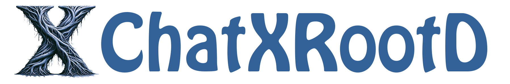

  

# ChatXRootD

LLM-driven [XRootD](https://xrootd.slac.stanford.edu/) documentation search and Q&amp;A

ChatXRootD is a Large Language Model (LLM)-powered chatbot designed to assist users with any questions they may have regarding [XRootD](https://xrootd.slac.stanford.edu/), the advanced data access protocol used extensively in managing large-scale scientific datasets. This chatbot takes advantages of Retrival Augmented Generation (RAG) to learn broad knowldege from XRootD documentation.

Key Features:

* Instant Assistance: Get immediate answers to your XRootD-related questions.
* Broad Knowledge Base: From basic setup and configuration to advanced troubleshooting and performance optimization.

Example Questions You Can Ask:

* "How do I configure XRootD?"
* "What are the best practices for configuring XRootD for high performance?"
* "What does OSS stand for?"
* "Can you explain the security features available in XRootD?"

> **Note**: This project is not affiliated with XRootD, nor the content can represent the viewpoint of the authors of the software. The chatbot may provide inaccurate information.

## Software Used in This Project

* [LangChain](https://github.com/langchain-ai/langchain): RAG with [FAISS](https://github.com/facebookresearch/faiss) as the vector store
* [ChainLit](https://github.com/Chainlit/chainlit): Out-of-box Web UI
* [OpenAI](https://openai.com/): Vector Embeddings and LLM (`gpt-3.5-turbo`)

Vector embeddings are available under [embeddings](./embeddings/) folder.
